# Relazione Starman tesina Matlab 2022 Segnali e Sistemi

## Parte 1: demodulazione del segnale x_t e ascolto
| 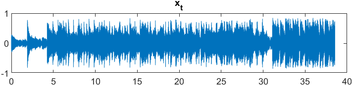 |
| :--: |
|Figura 1|

In Figura 1 vediamo il plot del segnale x_t caricato dal file audio.mat, vediamo che è un segnale di circa 40 secondi e sappiamo che è campionato a F=176400 Hz.
L’approssimazione della trasformata di x_t viene calcolata usando i comandi fft e fftshift di Matlab.
A differenza delle esercitazioni a lezione non è necessario moltiplicare per un esponenziale complesso la TDF perché stiamo considerando un segnale definito in un intervallo [0,40].

| 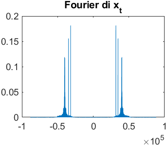 |
| :--: |
|Figura 2|

Plottando la TDF di x_t ( Figura 2 ) vediamo come ha dei picchi
centrali in ±40000Hz più altri 4 picchi in ±3 4750 Hz e in ±31700Hz. Sapendo che 𝑥𝑡(𝑡)=𝑥(𝑡)cos( 2 𝜋𝐹𝑚𝑡) e usando la proprietà di modulazione con 𝑋(𝑓):=𝑇𝐷𝐹\[𝑥(𝑡)\](𝑓) abbiamo che $$ 𝑋𝑡(𝑓)=\frac{1}2 𝑋(𝑓−𝐹𝑚)+ \frac12 𝑋(𝑓+𝐹𝑚) $$ quindi guardando il disegno capiamo che 𝐹𝑚= 40 𝐾ℎ𝑧 (il suggerimento che è multipla di 5KHz è verificato). Ora che conosciamo la frequenza di modulazione possiamo demodulare x_t e ascoltarlo. Per demodulare x_t basta moltiplicarlo per 2 volte la portante e poi filtrarlo con un filtro passa basso in modo da prendere solo la X(f) e non le traslazioni in frequenza.
| 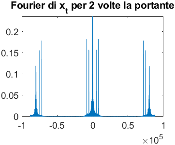 |
| :--: |
|Figura 3|

Questo ( Figura 3 ) è il plot della TDF del segnale x_t per 2 volte la portante, vediamo che oltre al supporto centrato in 0 ci sono anche 2 traslazioni con ampiezza metà di quella
centrale a ±80KHz. Se ascoltassimo così l’audio queste traslazioni non interferirebbero perché sono ad una frequenza troppo alta per l’udito ma filtriamo comunque perché come vedremo dopo non filtrare darebbe problemi nel caso di campionamento. Ho scelto come frequenza di stopband 40KHz perché è a metà tra 0 e 80000Hz.

Ascoltando il segnale usando le funzioni play e audioplayer sentiamo Starman di David Bowie con un fischio acuto sovrapposto alla canzone. Guardando la Figura 4 vediamo dei picchi in ±5250 e ±8300 che corrispondono agli artefatti presenti nella canzone. Per provarlo basta generare due sinusoidi in Matlab alle frequenze degli artefatti e ascoltandole con audioplayer viene un rumore simile a quello presente nel segnale demodulato.
| 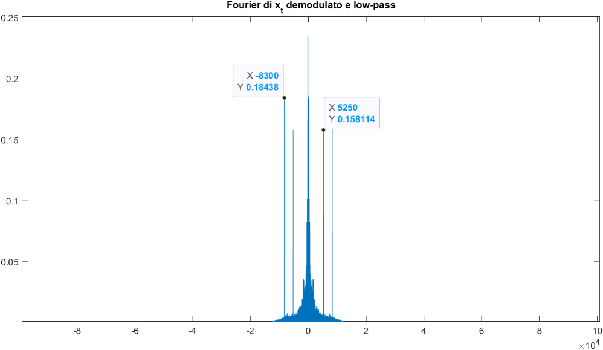 |
| :--: |
|Figura 4|

| 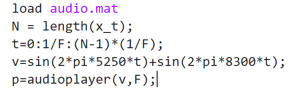 |
| :--: |
|Figura 5: come generare un artefatto simile a quello nella canzone|

| 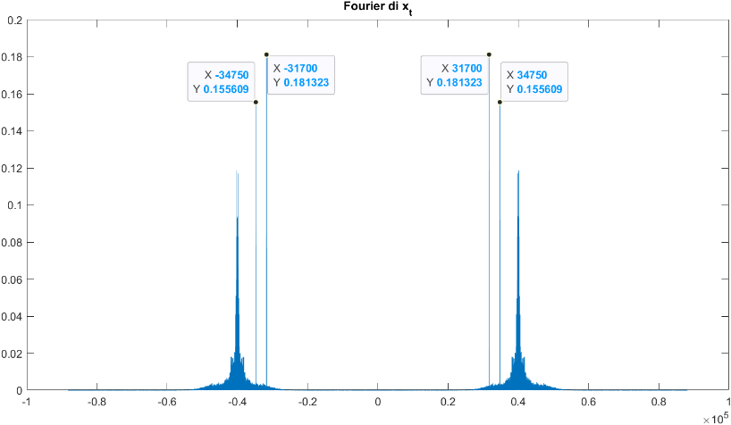 |
| :--: |
|Figura 6:  TDF con artefatti presenti|

## Parte 2: rimozione artefatti dal segnale

Ora noi vogliamo rimuovere questi artefatti dal segnale e guardando la Figura 6 vediamo come sono presenti delle componenti in frequenza a ±31700Hz e ±34750Hz nel segnale modulato x_t, queste componenti quando demoduliamo il segnale si manifestano nell’artefatto che abbiamo ascoltato prima. Quindi rimuovendo queste componenti dovremmo poter rimuovere l’artefatto dal segnale demodulato.

Per questo scopo si possono usare dei Notch filter che permettono di attenuare le componenti in frequenza in un intervallo molto stretto in modo da non perdere troppo del segnale originale quando rimuoviamo gli artefatti. Su Matlab per creare i Notch filter usiamo NF_design e passiamo come parametri: passo di campionamento 𝑇=1 /𝐹 dove F=176400Hz è la frequenza di campionamento del segnale e come frequenza di maggior attenuazione abbiamo per il primo filtro 31700Hz e per il secondo 34750Hz.
| 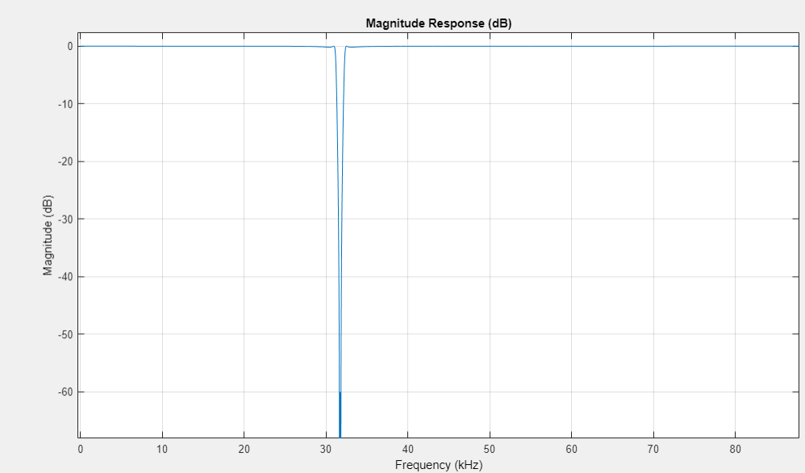 |
| :--: |
|Figura 7: risposta in frequenza del Notch filter|

In Figura 7 vediamo la risposta in frequenza del primo filtro (in dB). Si può notare come il filtro attenua in un piccolo intervallo attorno a 31.7KHz con la massima attenuazione in 31.7KHz.

Dopo aver filtrato il segnale lo demoduliamo moltiplicando per 2 volte la portante, se ora si ascolta il segnale demodulato non è più presente l’artefatto e si sente solo la canzone (dopo aver moltiplicato per 2 volte la portante sarebbe da filtrare con un low-pass filter ma per ora non è necessario, lo faremo quando dobbiamo campionare nella parte 3 per evitare l’aliasing). In Figura 8 vediamo la TDF del segnale dopo averlo moltiplicato per 2 volte la portante. Se filtriamo con un filtro passa basso otterremo una TDF uguale alla componente arancione in figura (ne parlerò meglio nella parte del campionamento).
| 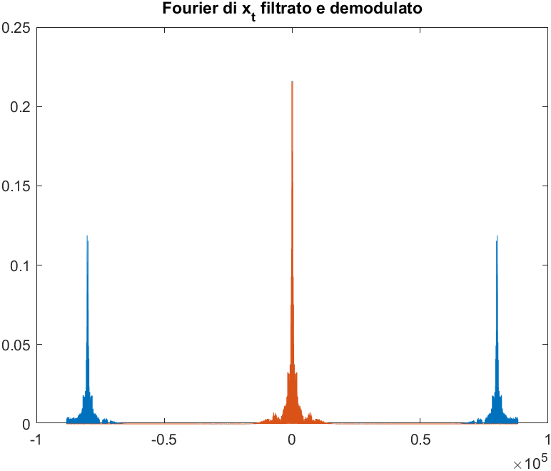 |
| :--: |
|Figura 8|

## Parte 3: campionamento

Vogliamo ottenere il segnale 𝑥𝑐 campionando x(t) con una frequenza di campionamento 𝐹𝑐=29400 Hz che notiamo essere 1/6 della frequenza F del segnale caricato con _load audio.mat._ Notiamo che F dev’essere per forza un multiplo intero di Fc altrimenti non avremmo i campioni necessari, avendo solo a disposizione una discretizzazione del segnale continuo. Per ottenere 𝑥𝑐 quindi prendiamo un elemento ogni 6 dal vettore da “campionare”; questo si può fare attraverso lo slicing dei vettori in Matlab con _x_c=x_filt_dem_rep(1:6:end);_ dove _x_filt_dem_rep_ e il segnale x_t filtrato con i due Notch filter e moltiplicato per 2 volte la portante.

Ora ascoltiamo x_c con _audioplayer_ ( _player3_ su Matlab) sentiamo come sono presenti nuovamente degli artefatti. Guardando la TDF di x_c ( _Figura 9_ ) vediamo come sono presenti delle componenti intorno a ±8Khz responsabili degli artefatti che sentiamo nel segnale campionato. Queste componenti sono dovute al fenomeno dell’aliasing, infatti, noi stiamo campionando a Fc=29400Hz ma se guardiamo la TDF del segnale che stiamo campionando (in _Figura 8_ ) vediamo come le due componenti in blu (che prima non sentivamo nell’audioplayer perché a frequenza superiore a quella udibile) si trovano a circa ±80Khz e quindi in questo caso non valgono le ipotesi del Teorema di Shannon che necessita Fc>2B dove in questo caso B è circa 90000Hz.

| 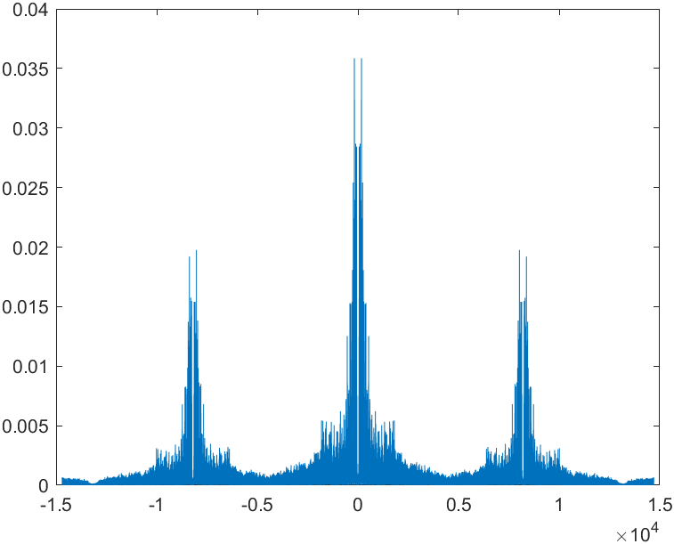 |
| :--: |
|Figura 9: TDF del segnale campionato|

Per poter avere un segnale campionato senza artefatti possiamo usare un filtro passa basso come filtro antialiasing prima di campionare, in modo che valga il Teorema di Shannon. Per creare un filtro passa basso su Matlab usiamo la funzione _LPF_design_ e come parametro passiamo il passo di campionamento (del segnale originale non di x_c) 1/F e la frequenza di stopband 29400/2 in modo che valga Fc>2B e non ci sia aliasing. In pratica stiamo tenendo solo la parte arancione della TDF in _figura 8._

In figura 10 vediamo la risposta in frequenza del filtro passa basso che inizia ad attenuare da frequenze intorno ai 14KHz. Quindi applichiamo questo filtro con la funzione filter di Matlab al segnale
| 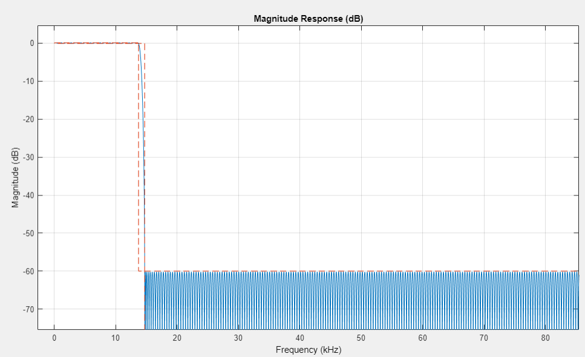 |
| :--: |
|Figura 10:  risposta in frequenza del filtro passa basso|

_x_filt_dem_rep_ e poi campioniamo sempre attraverso lo slicing dei vettori di Matlab e ora, ascoltando questa versione del segnale campionato dove abbiamo usato il filtro anti aliasing, possiamo sentire Starman senza artefatti.

Infatti, analizzando la TDF in _figura 11_ vediamo come non sono più presenti i picchi dovuti all’aliasing (a differenza della _figura 9)_.

| 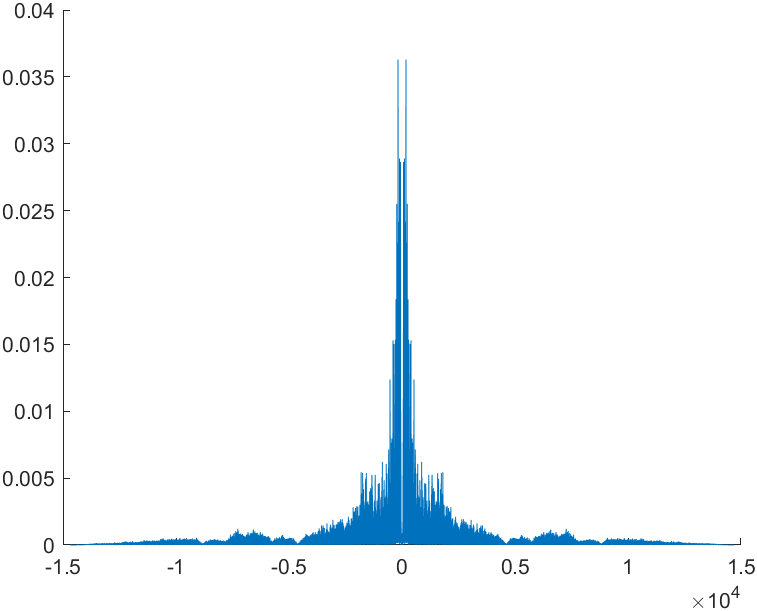 |
| :--: |
|Figura 11: TDF del segnale campionato usando il filtro antialiasing|
